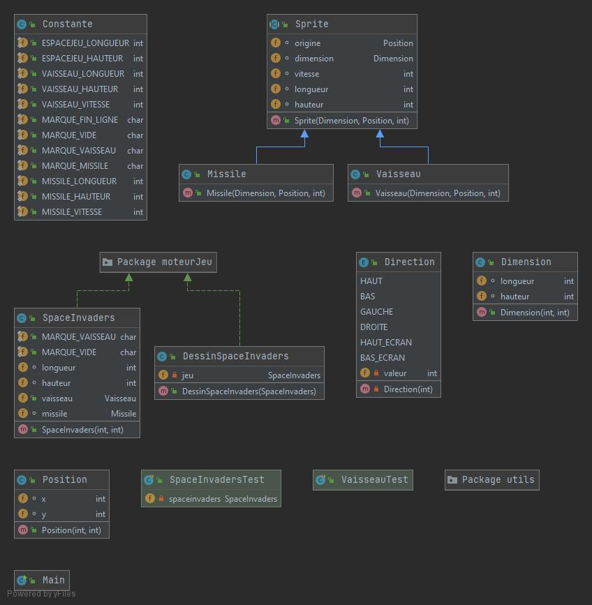
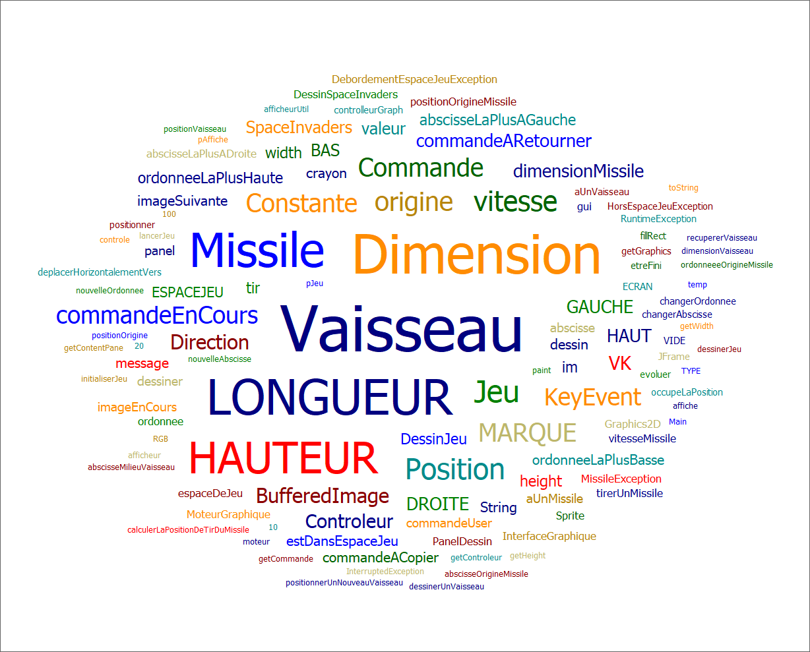
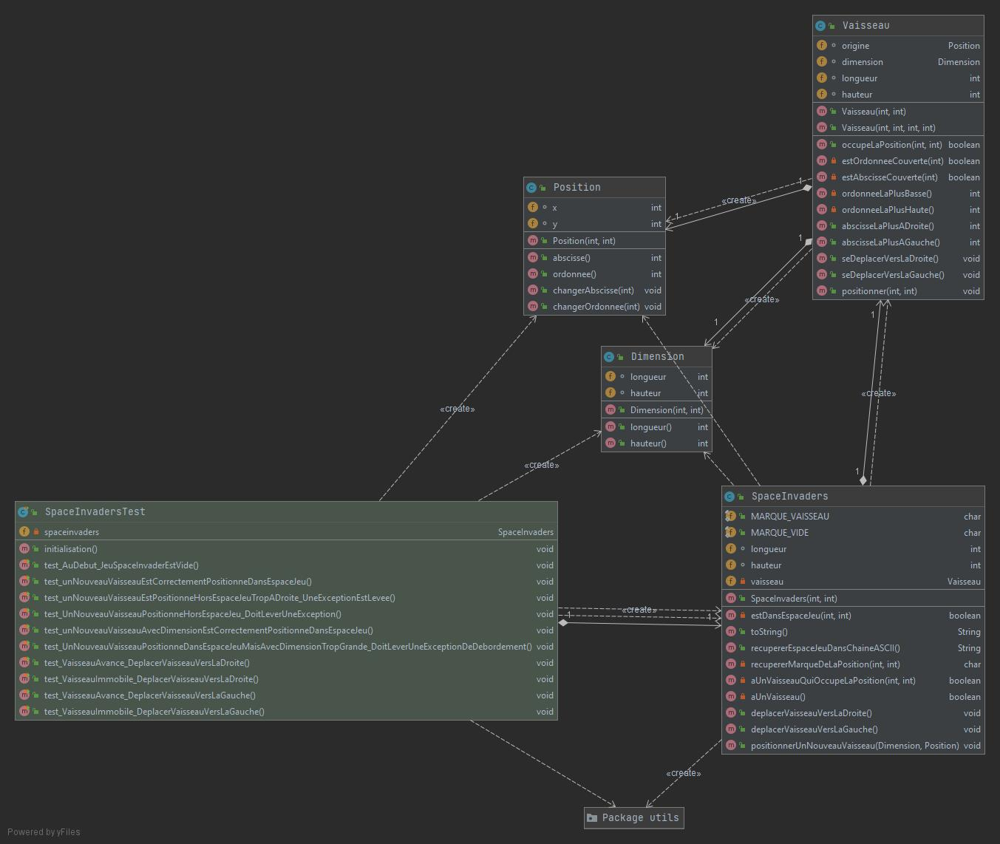
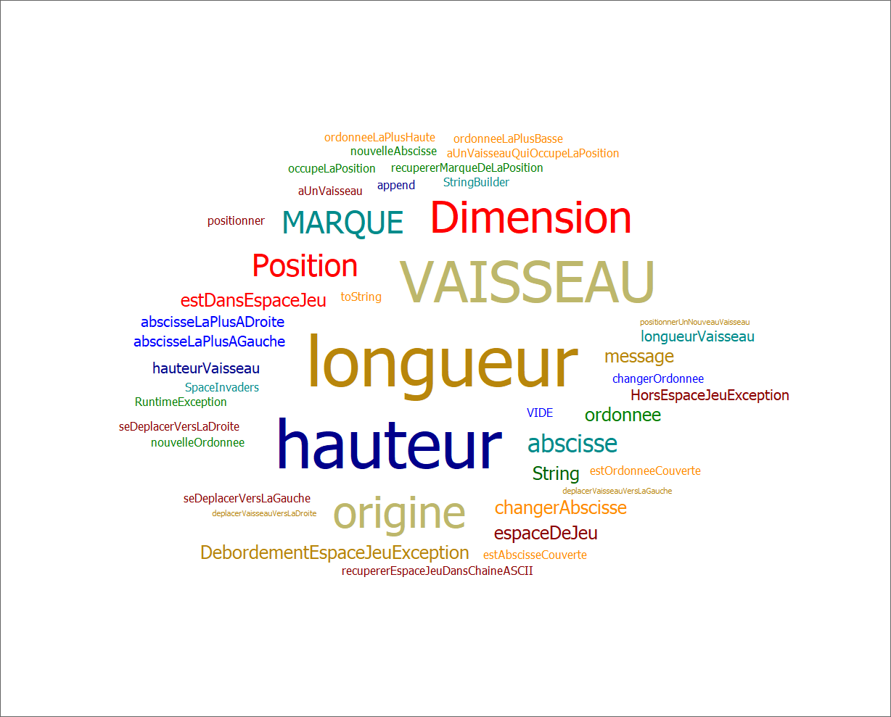
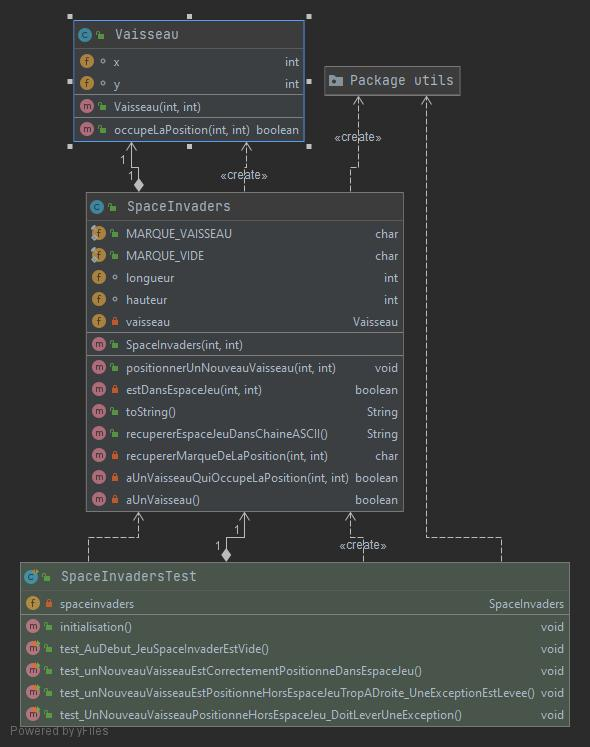
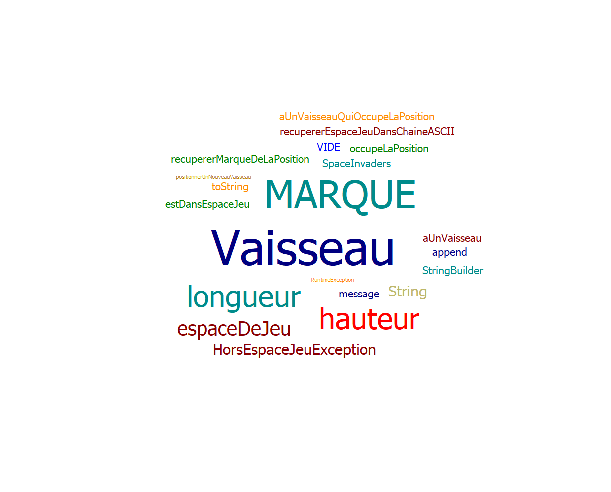

# SpaceInvaders

- [Semaine n°3 : du 17 au 21 mai](#semaine3)
- [Semaine n°2 : du 10 au 14 mai](#semaine2)
- [Semaine n°1 : du 26 au 30 avril](#semaine1)
- [Glossaire](#glossaire)

## Semaine n°3 : du 17 au 21 mai 

### Sprints et fonctionnalités réalisées : 

#### L'interface graphique a été faite

#### Fonctionnalité n°3 : Choisir la vitesse du vaisseau (terminée)
- Etape n°1 : Ajouter la vitesse au Vaisseau sans régression de comportement 
Attribut vitesse qui va permettre au vaisseau de se déplacer avec une vitesse pour le moment non paramétrable
- Etape n°2 : Régler la vitesse du vaisseau 
La vitesse du vaisseau est désormais paramétrable
- Etape n°3 : Faire en sorte que le déplacement se fasse correctement pour une vitesse quelconque 
Le vaisseau doit se déplacer correctement quel que soit la vitesse demandée par l'utilisateur
- Etape n°4 : Gestion graphique du vaisseau
Le vaisseau doit apparaitre et se déplacer avec une vitesse donnée à l'aide des flèches directionnelles dans l'espace de jeu

#### Fonctionnalité n°4 : Tirer un missile depuis le vaisseau (terminée)
- Etape n°1 : Tirer un missile
Permet à l'utilisateur de tirer un missile qui se positionne bien par rapport au vaisseau
- Etape n°2 : Gestion du missile dans le moteur graphique
Le missile apparait dans la fenetre graphique et le missile peut être tiré avec la barre espace
- Etape n°3 : Faire déplacer le missile à la verticale de manière autonome 
Le missile tiré doit se déplacer tout seul vers le bord supérieur de l'écran et disparaitre une fois le bord atteint. 

### Diagramme de classes (semaine n°3)  

### Nuage de mots du projet spaceinvaders (semaine n°3)  

### Difficultés rencontrées 
Difficultés sur la fin de la fonctionnalité 4 car j'avais des tests qui ne passaient pas et j'ai dû me reprendre à plusieurs fois avant de voir où était mon erreur ce qui m'a beaucoup ralenti. 

## Semaine n°2 : du 10 au 14 mai 

### Sprints et fonctionnalités réalisées : 

#### Fonctionnalité n°1 : Déplacer un vaisseau dans l'espace de jeu (terminée)  

- Story n°3 : Déplacer le vaisseau vers la droite dans l'espace de jeu
Le vaisseau se déplace d'un pas vers la droite 
Si le vaisseau se trouve sur la bordure droite de l'espace de jeu, le vaisseau doit rester immobile (aucun déplacement, aucune exception levée : le vaisseau reste juste à sa position actuelle).

- Story n°4 : Déplacer le vaisseau vers la gauche dans l'espace de jeu
Le vaisseau se déplace d'un pas vers la gauche Si le vaisseau se trouve sur la bordure gauche de l'espace de jeu, le vaisseau doit rester immobile (aucun déplacement, aucune exception levée : le vaisseau reste juste à sa position actuelle).

#### Fonctionnalité n°2 : Dimensionner le vaiseau  
- Etape n°1 : Positionner un nouveau vaisseau avec une dimension donnée 
Le vaisseau prend pour dimensions les paramètres donnés et se met à la position indiquée en paramètres.
- Etape n°2 : Faire en sorte qu'il soit impossible de positionner un nouveau vaisseau qui déborde de l'espace de jeu
Mise en place d'une exception pour ne pas faire dépasser un vaisseau hors de l'espace de jeu.
- Etape n°3 : Déplacer un vaisseau vers la droite en tenant compte de sa dimension
Le vaisseau doit se déplacer vers la droite sans dépasser de l'espace de jeu.
- Etape n°4 : Déplacer un vaisseau vers la gauche en tenant compte de sa dimension 
Le vaisseau doit se déplacer vers la droite sans dépasser de l'espace de jeu.

### Diagramme de classes (semaine n°2)  

### Nuage de mots du projet spaceinvaders (semaine n°2)  

### Difficultés rencontrées 
Aucune difficulté rencontrée

## Semaine n°1 : du 26 au 30 avril 

### Fonctionnalité en cours d’implémentation : 

#### Fonctionnalité n°1 : Déplacer un vaisseau dans l'espace de jeu (en cours d'implementation)

- Story n°1 : Créer un espace de jeu  
Un espace de jeu est créé aux dimensions données (2D) 
Cet espace de jeu est vide

-  Story n°2 : Positionner un nouveau vaisseau dans l’espace de jeu  
Un nouveau vaisseau est créé
Le vaisseau est positionné aux coordonnées transmises
Si un nouveau vaisseau essaye d’être positionné en dehors des limites de l’espace jeu, alors une exception devra être levée.
 Contraintes :
La position souhaitée est transmise par ses coordonnées x et y.
Le coin supérieur gauche de l’espace jeu (point en haut à gauche) a pour coordonnées (0,0)
La taille du vaisseau est réduite pour l'instant à son minimum (1 seul point)    

- Story n°3 : Déplacer le vaisseau vers la droite dans l'espace de jeu (en cours)
Le vaisseau se déplace d'un pas vers la droite 
Si le vaisseau se trouve sur la bordure droite de l'espace de jeu, le vaisseau doit rester immobile (aucun déplacement, aucune exception levée : le vaisseau reste juste à sa position actuelle).

### Diagramme de classes (semaine n°1)  

### Nuage de mots du projet spaceinvaders (semaine n°1)  

### Difficultés rencontrées 
Dans la story n°2, j'ai eu un problème lors du refactoring de la méthode aUnVaisseauQuiOccupeLaPosition car mon IDE avait inversé le x et le y en paramètres et je n'y avait pas fait attention. Je me suis donc retrouvé à avoir des tests qui ne marchaient pas.

### Remarques diverses
 Pour pouvoir, mettre en place les tests, il a été nécessaire d’ajouter une fonctionnalité supplémentaire qui permet de représenter l’espace de jeu dans une chaîne ASCII.

## Glossaire 

* **Vaisseau** :  véhicule commandé par le joueur, pouvant se déplacer de droite à gauche et ayant la possibilité de lancer des missiles destinés à détruire le(s) envahisseurs.

* **Envahisseur**  :  ennemi qui apparaît à l'écran, se déplace automatiquement et qui doit être détruit par un missile lancé depuis le vaisseau du joueur.

* **Missile** :  projectile envoyé à la verticale par le vaisseau vers l'envahisseur dans le but de le détruire.

* **Vitesse** :  unité qui mesure le déplacement d'un objet ou d'une personne sur une seule dimension dans notre cas.

------------- 
